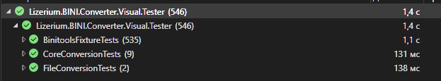

<h1 align="center">Lizerium.BINI.Converter</h1>

<div align="center" style="margin: 20px 0; padding: 10px; background: #1c1917; border-radius: 10px;">
  <strong>🌐 Язык: </strong>

  <span style="color: #0891b2; margin: 0 10px;">
    ✅ 🇷🇺 Russian (current)
  </span>
  |
  <a href="./README.md" style="color: #F5F752; margin: 0 10px;">
    🇺🇸 English
  </a>
</div>

<div align="center">

  
  

</div>

---

> [!NOTE]
> Этот проект является частью экосистемы **Lizerium** и относится к направлению:
>
> - [`Lizerium.Tools.Structs`](https://github.com/Lizerium/Lizerium.Tools.Structs)
>
> Если вы ищете связанные инженерные и вспомогательные инструменты, начните оттуда.

---

`Lizerium.BINI.Converter` - .NET 8 toolkit для файлов Freelancer BINI: распаковывает бинарный BINI в редактируемый текстовый INI и собирает текстовый INI обратно в игровой формат.

## Что Умеет


---

- Конвертирует Freelancer `.ini` в обе стороны: `BINI -> text INI` и `text INI -> BINI`.
- Автоматически определяет BINI по сигнатуре файла.
- Сохраняет особенности Freelancer: типы значений, quoting строк, числовые значения и проверки поврежденных файлов по мотивам [skeeto/binitools](https://github.com/skeeto/binitools).
- Поставляется как библиотека и как готовое приложение `Lizerium.BINI.Converter.App`.
- Включает локальный web overlay: перетащи `.ini` в браузер, сконвертируй, скачай результат и посмотри preview для текстового INI.
- Включает статический GitHub Pages portal с browser JavaScript BINI converter.
- Содержит консольный tester без внешних test framework зависимостей: binitools fixtures и optional roundtrip по папке Freelancer.
- Содержит xUnit проект с тестами. (546+ тестов)
  - 
- Пример web-портала - https://lizerium.github.io/Lizerium.BINI.Converter/

## Проекты

- `app/Lizerium.BINI.Converter` - переиспользуемая библиотека `net8.0`.
- `app/Lizerium.BINI.Converter.App` - CLI и локальный web overlay.
- `app/Lizerium.BINI.Converter.Tester` - консольный verification runner.
- `app/Lizerium.BINI.Converter.Visual.Tester` - xUnit test project для Test Explorer и CI.

## Документация

Все инструкции лежат в `docs`:

- [Использование NuGet-пакета](docs/info/nuget.ru.md)
- [App, CLI и web overlay](docs/info/app.ru.md)
- [Сборка и проверка](docs/info/build.ru.md)
- [Roadmap](docs/info/TODO.md)
- [Статический portal](docs/README.ru.md)

## Быстрый Пример

```csharp
using Lizerium.BINI.Converter;

byte[] bini = File.ReadAllBytes("market_commodities.ini");
string text = BiniConverter.ConvertBiniToText(bini);

byte[] packed = BiniConverter.ConvertTextToBini(text);
```

## Благодарности за .c код

Christopher Wellons - [skeeto/binitools](https://github.com/skeeto/binitools)
